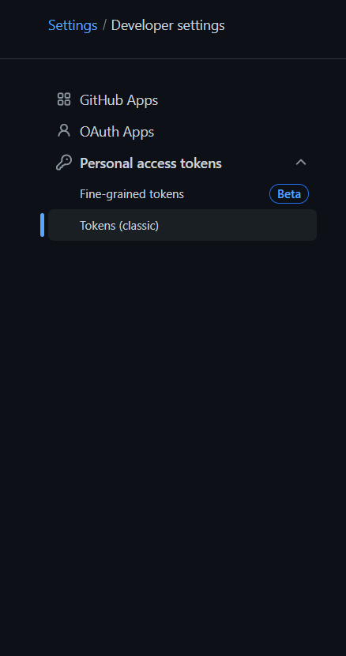
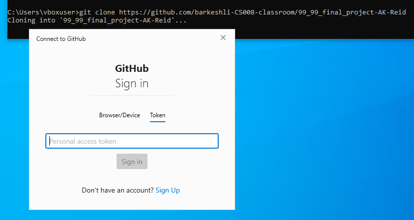
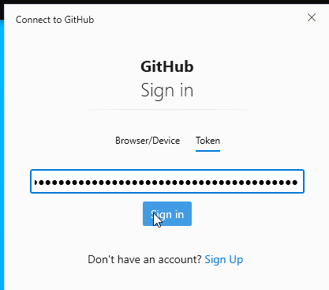
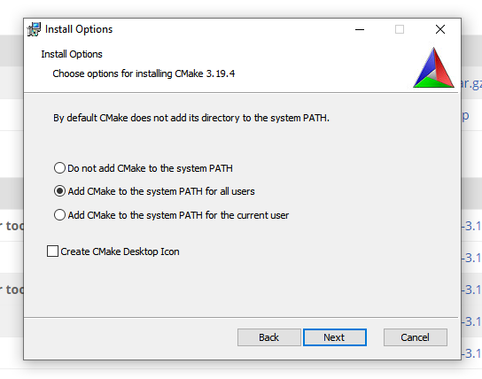
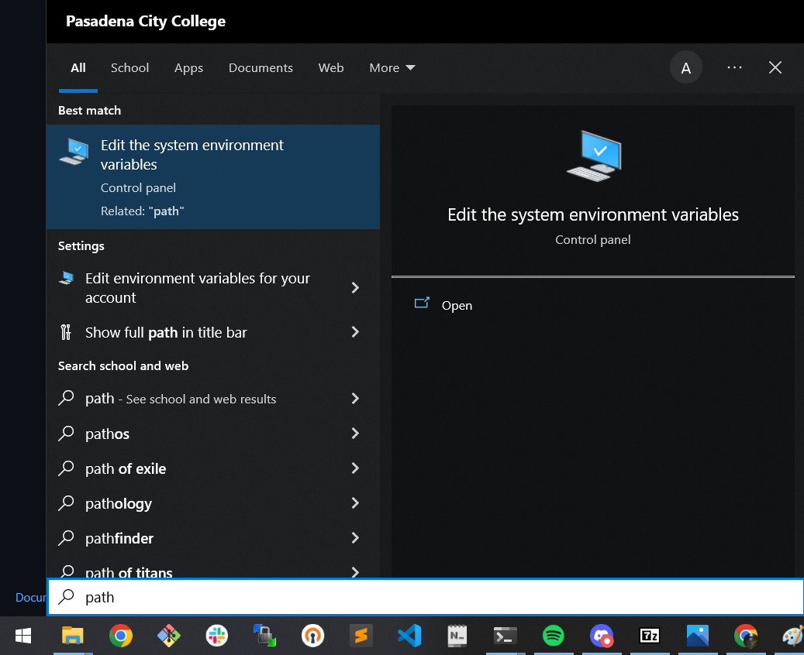
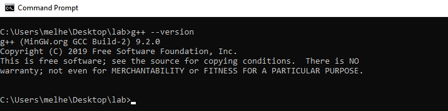

# Windows Instructions

- ## [Installing `git`](#win_installing_git)
- ## [Installing `cmake`](#win_installing_cmake)
- ## [Installing `MinGW`](#win_installing_mingw)

---


#  Installing git 


## Download `git`

Grab the latest 64 bit git setup from [here](https://git-scm.com/download/win).

> 

<br>

## Install `git`

Double click the executable, i.e `Git-2.40.0.1-64-bit.exe`, just keep clicking next and install. The **default options** for everything is perfectly fine.<br>


> 

#### Ensure that `git` was succesfully installed
<br>

Run `git --version` in your command prompt:<br>

> 
<br>

If you see the above output, you're good to go, otherwise reinstall `git`.

## Configure git:

The steps in this section are very important.

First, let git know who you are, set your global name and email address in your command prompt, this only needs to be done once.
You can paste commands into your Command Prompt by right clicking.

```
git config --global user.name "John Doe"
git config --global user.email johndoe@example.com
```
This is important because every git commit you make will have this information baked into it. This is your identity.

If you like you may also check that your name and email were set correctly with `git config --get user.name` and `git config --get user.email`

#### Personal access tokens:
**Very important:** You will not be able to clone your repositories without first setting up a GitHub Personal Access Token. This is key that grants access to all your repositories, so be very careful with it.

Go to `github.com`, click your profile picture on the top right, click on `settings`. On the sidebar of the next page click `Developer settings` at the very bottom. At the bottom of the sidebar on the next page, click `personal access tokens`

Go to your profile settings   |  Go to `Developer Settings` | Create a `classic` token
:-------------------------:|:-------------------------:|:-------------------------:
  |   |  


|   |
| :----------------------------------------: |
|      **Generate a new token**     |

|    |
| :----------------------------------------: |
|      **Set an expiration date, check the `repo` box, leave all the boxes below unchecked, scroll down and click `Generate token`**   |

**Set an expiration date for your tokens! I highly recommend setting a custom expiration date that's just after finals week. Around Dec 20th for Fall and June 20th for Spring should be good. In the unfortunate event your token is ever compromised months or years down the line, you wont have to worry about the tokens you generated during your studies being the reason you got fired.**

#### Finally, here is your token, this is the first and last time GitHub is going to show it to you, so put it in a secure folder or write it down on paper for future access.


## Cloning a repository


The first time you attempt to clone one of your own repos you will be met with this prompt  |  Go to the `Token` tab and paste in your token
:-------------------------:|:-------------------------:
  |  

**After doing this once you will have permissions to clone repos unprompted.**

<br><br><br>

<a name="win_installing_cmake"></a>

#  Installing cmake 


### Download `cmake`

Download cmake from [here](https://cmake.org/download/). Choose the `Windows win64-x64 Installer`. You should get an msi with a name similar to this: `cmake-3.19.4-win64-x64.msi`<br>

> 

<br>

You may blindly click through the setup wizard, except for setting the path  |  Important: Make sure to select `Add CMake PATH for all users`
:-------------------------:|:-------------------------:
 |  

### Check that cmake was installed succesfully:

To make sure `cmake` is intalled correctly, run `cmake --version`:
<br>

> 

If you see something like this, you're good to go!

<br>

---


<a name="win_installing_mingw"></a>

#  Install MinGW 


## Download `MinGW`

Download MinGW from [here](https://github.com/niXman/mingw-builds-binaries/releases). Download the release in below screenshot
> 

Once downloaded use your favorite archive manager(e.g WinRAR, 7-Zip) to extract the archive straight to your C:\ drive
> 


## Set your path environment variable for C++

Search for "path" in the task bar search box. Open Edit the system environment variables.

Edit `system  environment variables`   |  Click `Environment Variables` | Select `Path` variable and click `Edit`| Click 'New' and paste in your `MinGW` path `C:\mingw64\bin`
:-------------------------:|:-------------------------:|:-------------------------:|:-------------------------:
   |   |   |  


> 

<br>

Click on "Environment Variables..."

> 

<br>

Add the path to the gcc and g++ executables to environment variables as shown below and press OK.<br>

> 

<br>

Next, double click on the **user variable** Path (in the top half of the window). A window like this should pop up:

> 

<br>

Click New, and enter C:\MinGW\bin to the text box. Click OK.<br>

> 

<br>

Your environment and user variables should look like this after you are done:<br>

> 

<br><br><br>

## Check the version of the g++ again:

To make sure `MinGW`/`g++` is intalled correctly, run `g++ --version` again. If the version output doesn't show, reboot your machine and try again.<br><br>

> 

<br>

---

## Once all software has been installed, continue to the [next step](start_project.md)
